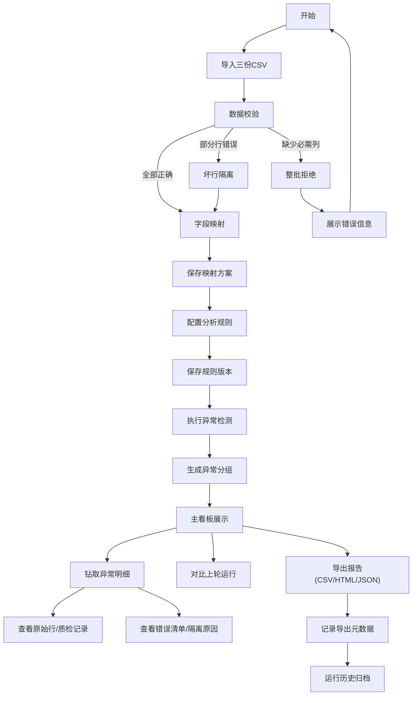

## 1. 产品概述

售后退货异常分析看板是一款面向电商运营和质量管控团队的数据分析工具，通过导入订单、退货、质检三类业务数据，配置异常检测规则，自动识别超期退货、重复退货、质检冲突等异常批次，支持坏行隔离、历史追溯和多格式报告导出，帮助团队快速定位问题、追溯根因、优化退货流程。

- 核心价值：将分散的退货数据转化为可行动的异常洞察，降低人工排查成本，提升退货处理效率
- 目标用户：电商运营专员、质量分析师、售后主管

## 2. 核心功能

### 2.1 功能模块

1. **数据导入模块**：支持订单表、退货表、质检表三份 CSV 批量导入，提供示例数据一键加载
2. **字段映射配置**：可视化映射 CSV 列名与系统标准字段，支持保存和复用映射方案
3. **规则配置中心**：配置超期天数阈值、重复退货时间窗口、质检冲突判定规则
4. **异常分析引擎**：按规则生成异常批次与明细，支持按异常类型自动分组
5. **运行历史管理**：记录每次分析运行的参数、结果摘要，支持历史版本对比
6. **坏行隔离机制**：自动识别数据质量问题，区分整批拒绝与单行隔离场景
7. **报告导出系统**：支持 CSV/HTML/JSON 三种格式导出，导出元数据可追溯源批次和规则版本
8. **主看板界面**：展示异常概览、趋势对比、分组钻取，支持从异常组跳转到原始行、质检记录、错误清单

### 2.2 页面详情

| 页面名称 | 模块名称 | 功能描述 |
|---------|----------|----------|
| 主看板 | 异常概览卡片 | 展示异常总数、按类型分布、与上轮运行对比变化 |
| 主看板 | 异常分组列表 | 按超期/重复/冲突分组展示，支持数量统计和跳转 |
| 主看板 | 运行历史侧边栏 | 展示最近运行记录，支持切换查看历史结果 |
| 数据导入 | 文件上传区 | 拖拽上传三份 CSV 文件，提供示例数据下载 |
| 数据导入 | 数据预览 | 上传后展示前 10 行数据和列名识别 |
| 字段映射 | 映射配置表 | CSV 列与系统字段的可视化映射，支持保存方案 |
| 规则配置 | 规则表单 | 超期天数、重复窗口、质检冲突规则配置 |
| 异常详情 | 明细列表 | 展示异常批次详情，关联原始行、质检记录 |
| 异常详情 | 错误清单 | 展示坏行列表、隔离原因、处理说明 |
| 报告导出 | 导出面板 | 选择格式、配置导出范围，查看最近导出记录 |

## 3. 核心流程

用户登录后进入主看板，可查看最近分析结果。如需新一轮分析，依次完成：上传 CSV 文件 → 确认/配置字段映射 → 配置异常规则 → 执行分析 → 查看异常分组 → 钻取明细 → 标记处理 → 导出报告。所有操作均记录运行历史，支持随时回溯。

## 4. 用户界面设计

### 4.1 设计风格

- **主色调**：专业深蓝 `#1e3a5f`，象征数据可信度和企业级质感
- **辅助色**：警示橙 `#f59e0b`（超期）、危险红 `#ef4444`（冲突）、信息蓝 `#3b82f6`（重复）
- **中性色**：深灰 `#1f2937`、中灰 `#6b7280`、浅灰 `#f3f4f6`、纯白 `#ffffff`
- **字体**：标题使用 `Playfair Display` 提升专业感，正文使用 `Inter` 保证可读性
- **布局**：左侧导航 + 主内容区 + 右侧抽屉式详情面板，三栏式专业布局
- **动效**：卡片悬停微阴影、数据加载骨架屏、数字滚动动画、抽屉平滑滑入
- **质感**：半透明玻璃态卡片、细腻渐变背景、精致边框分隔

### 4.2 页面设计概览

| 页面名称 | 模块名称 | UI 元素 |
|---------|----------|----------|
| 主看板 | 异常概览卡片 | 渐变背景卡片、带箭头的环比变化指示、图标+数字组合 |
| 主看板 | 异常分组列表 | 标签式分组切换、数据表格、行悬停高亮、操作按钮 |
| 数据导入 | 文件上传区 | 虚线拖拽区域、文件图标动画、上传进度条 |
| 字段映射 | 映射配置表 | 下拉选择器、保存按钮、已保存方案下拉 |
| 规则配置 | 规则表单 | 数字输入框、滑块控件、开关按钮、预设规则快捷按钮 |
| 异常详情 | 抽屉面板 | 标签页切换（明细/质检/错误/处理）、关联数据卡片 |
| 报告导出 | 导出面板 | 格式选择卡片、导出范围复选框、最近导出列表 |

### 4.3 响应式

- 桌面端优先设计（≥1280px），三栏布局完整呈现
- 平板端（768-1279px）：右侧抽屉改为底部弹出，导航简化为图标
- 移动端（<768px）：单列布局，Tab 切换主要功能模块，触控目标≥44px

### 4.4 数据可视化

- 使用 `recharts` 实现异常类型分布饼图、趋势对比折线图
- 自定义颜色映射：超期=橙色、重复=蓝色、冲突=红色
- 图表支持悬停显示详情、点击筛选对应数据
