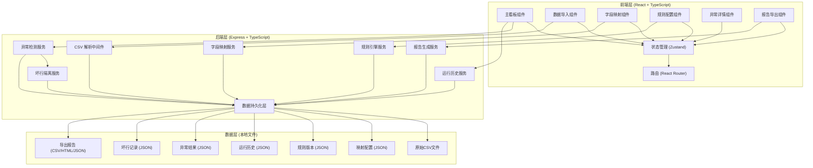
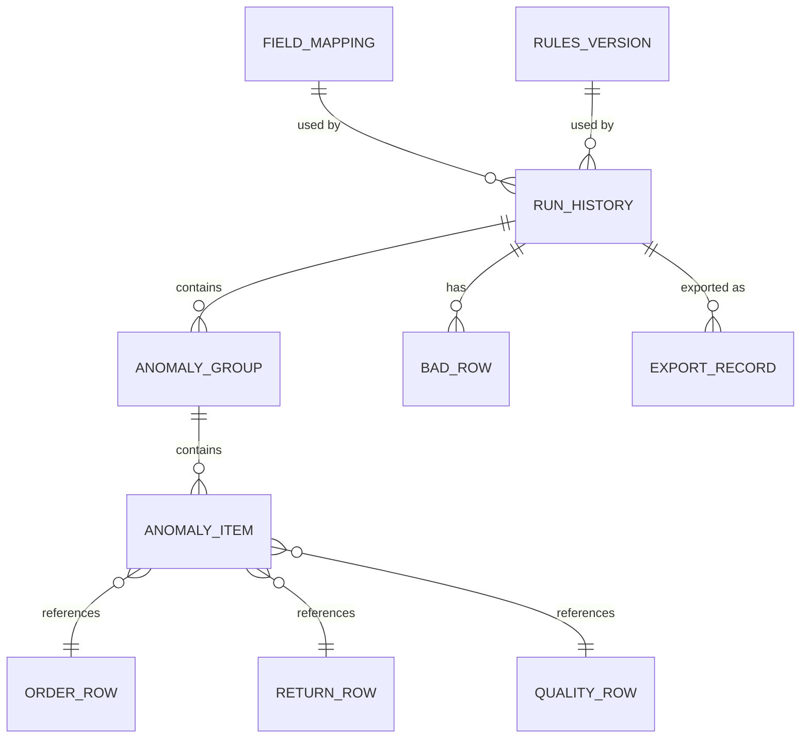

## 1. 架构设计

本项目采用前后端分离架构，前端使用 React 构建交互式看板，后端使用 Express 提供数据处理 API，数据持久化采用本地文件存储（JSON + CSV）以保证轻量性和可移植性。



## 2. 技术描述

- **前端框架**: React@18 + TypeScript + Vite
- **状态管理**: Zustand@4
- **路由**: React Router DOM@6
- **样式方案**: TailwindCSS@3
- **UI 组件**: 自定义组件 + lucide-react 图标
- **图表库**: Recharts@2
- **CSV 解析**: Papa Parse@5
- **后端框架**: Express@4 + TypeScript
- **数据存储**: 本地文件系统 (JSON/CSV)
- **开发工具**: ts-node, nodemon, concurrently

## 3. 项目结构

```
├── src/                          # 前端源码
│   ├── components/               # 可复用组件
│   │   ├── layout/              # 布局组件
│   │   ├── dashboard/           # 看板组件
│   │   ├── import/              # 导入组件
│   │   ├── mapping/             # 字段映射组件
│   │   ├── rules/               # 规则配置组件
│   │   ├── anomalies/           # 异常详情组件
│   │   ├── export/              # 导出组件
│   │   └── common/              # 通用组件
│   ├── pages/                   # 页面组件
│   ├── store/                   # Zustand 状态管理
│   ├── utils/                   # 工具函数
│   ├── types/                   # TypeScript 类型定义
│   ├── hooks/                   # 自定义 Hooks
│   ├── App.tsx
│   └── main.tsx
├── api/                          # 后端源码
│   ├── routes/                  # 路由定义
│   ├── services/                # 业务逻辑服务
│   ├── middleware/              # 中间件
│   ├── types/                   # 类型定义
│   ├── utils/                   # 工具函数
│   └── server.ts
├── shared/                       # 前后端共享类型
├── data/                         # 本地数据存储
│   ├── raw/                     # 原始CSV文件
│   ├── mappings/                # 字段映射配置
│   ├── rules/                   # 规则版本
│   ├── history/                 # 运行历史
│   ├── anomalies/               # 异常结果
│   ├── badrows/                 # 坏行记录
│   └── exports/                 # 导出报告
├── public/                      # 静态资源
└── sample-data/                 # 示例数据
```

## 4. 路由定义

| 路由 | 页面 | 用途 |
|------|------|------|
| `/` | 主看板 | 异常概览、分组列表、趋势对比 |
| `/import` | 数据导入 | CSV上传、数据预览、示例数据加载 |
| `/mapping` | 字段映射 | 配置CSV列与系统字段映射 |
| `/rules` | 规则配置 | 超期天数、重复窗口、质检冲突规则 |
| `/anomalies/:type` | 异常详情 | 按类型查看异常明细、钻取原始数据 |
| `/export` | 报告导出 | 选择格式、导出范围、查看历史导出 |
| `/history` | 运行历史 | 查看所有历史运行记录、对比分析 |

## 5. API 定义

### 5.1 数据导入 API

```typescript
// POST /api/import/upload
interface UploadRequest {
  fileType: 'order' | 'return' | 'quality';
  file: File;
}

interface UploadResponse {
  success: boolean;
  fileId: string;
  columns: string[];
  preview: any[];
  rowCount: number;
  errors?: ValidationError[];
  rejectAll?: boolean;
}

// GET /api/import/sample
interface SampleDataResponse {
  order: { columns: string[]; data: any[] };
  return: { columns: string[]; data: any[] };
  quality: { columns: string[]; data: any[] };
}
```

### 5.2 字段映射 API

```typescript
// GET /api/mapping
interface MappingResponse {
  savedMappings: FieldMapping[];
  currentMapping?: FieldMapping;
}

// POST /api/mapping/save
interface SaveMappingRequest {
  name: string;
  mapping: {
    order: Record<string, string>;
    return: Record<string, string>;
    quality: Record<string, string>;
  };
}

interface SaveMappingResponse {
  success: boolean;
  mappingId: string;
}
```

### 5.3 规则配置 API

```typescript
// GET /api/rules
interface RulesResponse {
  currentRules: AnalysisRules;
  history: RulesVersion[];
}

// POST /api/rules/save
interface SaveRulesRequest {
  rules: AnalysisRules;
}

interface SaveRulesResponse {
  success: boolean;
  rulesId: string;
}
```

### 5.4 异常分析 API

```typescript
// POST /api/analyze/run
interface AnalyzeRequest {
  mappingId: string;
  rulesId: string;
  orderFileId: string;
  returnFileId: string;
  qualityFileId: string;
}

interface AnalyzeResponse {
  success: boolean;
  runId: string;
  summary: AnalysisSummary;
  anomalies: AnomalyGroup[];
  badRows: BadRow[];
}

// GET /api/analyze/history
interface HistoryResponse {
  runs: RunHistory[];
}

// GET /api/analyze/compare/:runId1/:runId2
interface CompareResponse {
  run1: RunHistory;
  run2: RunHistory;
  diff: ComparisonDiff;
}
```

### 5.5 报告导出 API

```typescript
// POST /api/export
interface ExportRequest {
  runId: string;
  format: 'csv' | 'html' | 'json';
  includeTypes: AnomalyType[];
  includeBadRows: boolean;
}

interface ExportResponse {
  success: boolean;
  exportId: string;
  downloadUrl: string;
  metadata: ExportMetadata;
}

// GET /api/export/history
interface ExportHistoryResponse {
  exports: ExportRecord[];
}
```

## 6. 数据模型

### 6.1 核心实体关系



### 6.2 核心数据类型

```typescript
// 系统标准字段定义
interface SystemFields {
  order: ['orderId', 'orderDate', 'customerId', 'productId', 'amount'];
  return: ['returnId', 'orderId', 'returnDate', 'reason', 'status'];
  quality: ['qualityId', 'orderId', 'inspectDate', 'result', 'defectType'];
}

// 分析规则
interface AnalysisRules {
  overdueDays: number;           // 超期天数阈值
  duplicateReturnWindow: number; // 重复退货窗口(天)
  qualityConflictTypes: string[]; // 质检冲突类型
  enableAutoIsolate: boolean;    // 是否自动隔离坏行
}

// 异常类型
type AnomalyType = 'overdue' | 'duplicate' | 'conflict';

// 异常分组
interface AnomalyGroup {
  type: AnomalyType;
  count: number;
  description: string;
  items: AnomalyItem[];
}

// 异常明细
interface AnomalyItem {
  id: string;
  orderId: string;
  returnId?: string;
  qualityId?: string;
  anomalyType: AnomalyType;
  description: string;
  severity: 'low' | 'medium' | 'high';
  rawData: {
    order?: any;
    return?: any;
    quality?: any;
  };
  createdAt: string;
}

// 坏行记录
interface BadRow {
  id: string;
  fileType: 'order' | 'return' | 'quality';
  rowIndex: number;
  rowData: any;
  errorType: 'missing_column' | 'invalid_date' | 'invalid_value' | 'duplicate_order';
  errorMessage: string;
  isolationReason: string;
  handled: boolean;
  handleNote?: string;
}

// 运行历史
interface RunHistory {
  id: string;
  mappingId: string;
  rulesId: string;
  files: {
    order: { fileId: string; fileName: string; rowCount: number };
    return: { fileId: string; fileName: string; rowCount: number };
    quality: { fileId: string; fileName: string; rowCount: number };
  };
  summary: AnalysisSummary;
  status: 'completed' | 'failed' | 'partial';
  createdAt: string;
  completedAt: string;
}

// 导出元数据
interface ExportMetadata {
  exportId: string;
  runId: string;
  mappingId: string;
  rulesId: string;
  format: string;
  exportedAt: string;
  includedTypes: string[];
  recordCount: number;
}
```

## 7. 关键技术决策

1. **本地文件存储**：使用 JSON + CSV 本地文件存储，无需数据库依赖，项目可直接运行，便于移植和演示
2. **前后端共享类型**：在 `shared/` 目录定义前后端共用的 TypeScript 类型，确保类型一致性
3. **规则引擎设计**：采用策略模式实现异常检测规则，便于后续扩展新的异常类型
4. **数据版本化**：字段映射和分析规则均采用版本化管理，每次运行关联特定版本，支持完整追溯
5. **渐进式数据校验**：导入时先进行整体结构校验（决定是否整批拒绝），再进行行级校验（决定是否隔离坏行）
